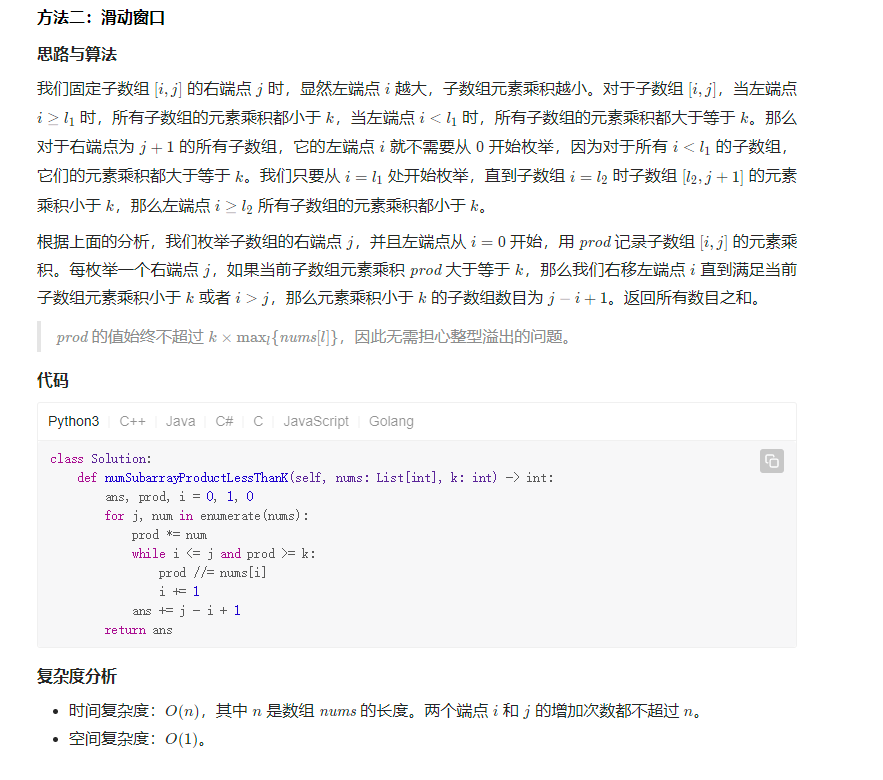
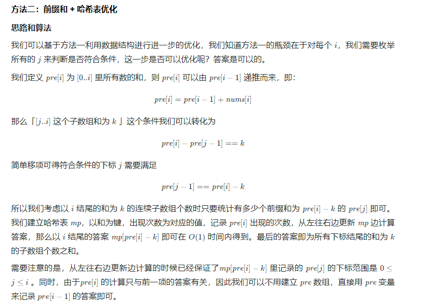
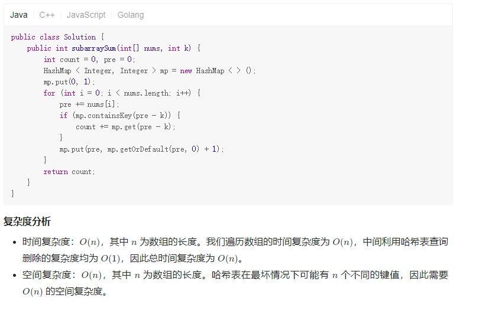

# 自评题目难度

> 注：
>
> 题目难度划分为：1——10；
>
> 同等题型下：由于开始刷题不够熟练，故评分可能较高，后期熟练后评分可能较低。

## 剑指Offer

| #                 | 题名               | 难度 |
| ----------------- | ------------------ | ---- |
| 剑指 Offer 03     | 数组中重复的数字   | 2    |
| 剑指 Offer 04     | 二维数组中的查找   | 3    |
| 剑指 Offer 05     | 替换空格           | 1    |
| 剑指 Offer 06     | 从尾到头打印链表   | 2    |
| 剑指 Offer 07     | 重建二叉树         | 5    |
| 剑指 Offer 09     | 用两个栈实现队列2  | 2    |
| 剑指 Offer 10- I  | 斐波那契数列       | 3    |
| 剑指 Offer 10- II | 青蛙跳台阶问题     | 3    |
| 剑指 Offer 11     | 旋转数组的最小数字 | 3    |

> 剑指 Offer 07————重建二叉树
>
> 剑指 Offer 11 ———— 旋转数组的最小数字

| #                 | 题名                                  | 难度 |
| ----------------- | ------------------------------------- | ---- |
| 剑指 Offer 12     | 矩阵中的路径                          | 4    |
| 剑指 Offer 13     | 机器人的运动范围                      | 3    |
| 剑指 Offer 14- I  | 剪绳子                                | 3    |
| 剑指 Offer 14- II | 剪绳子 II                             | 3    |
| 剑指 Offer 15     | 二进制中1的个数                       | 3    |
| 剑指 Offer 16     | 数值的整数次方                        | 2    |
| 剑指 Offer 17     | 打印从1到最大的n位数                  | 2    |
| 剑指 Offer 18     | 删除链表的节点                        | 2    |
| 剑指 Offer 19     | 正则表达式匹配 | 6    |
| 剑指 Offer 20     | 表示数值的字符串                      | 3    |

> 剑指 Offer 17———— 使用全排列解决大数越界问题
>
> 剑指 Offer 19————正则表达式匹配
>
> > 关注正则表达式 B 的最后一个字符是谁

| #             | 题名                           | 难度 |
| ------------- | ------------------------------ | ---- |
| 剑指 Offer 21 | 调整数组顺序使奇数位于偶数前面 | 1    |
| 剑指 Offer 22 | 链表中倒数第k个节点            | 2    |
| 剑指 Offer 24 | 反转链表                       | 2    |
| 剑指 Offer 25 | 合并两个排序的链表             | 2    |
| 剑指 Offer 26 | 树的子结构                     | 3    |
| 剑指 Offer 27 | 二叉树的镜像                   | 2    |
| 剑指 Offer 28 | 对称的二叉树                   | 3    |
| 剑指 Offer 29 | 顺时针打印矩阵                 | 2    |
| 剑指 Offer 30 | 包含min函数的栈                | 1    |
| 剑指 Offer 31 | 栈的压入、弹出序列             | 2    |

> 

| #                   | 题名                         | 难度 |
| ------------------- | ---------------------------- | ---- |
| 剑指 Offer 32 - I   | 从上到下打印二叉树           | 2    |
| 剑指 Offer 32 - II  | 从上到下打印二叉树 II        | 2    |
| 剑指 Offer 32 - III | 从上到下打印二叉树 III       | 3    |
| 剑指 Offer 33       | 二叉搜索树的后序遍历序列     | 4    |
| 剑指 Offer 34       | 二叉树中和为某一值的路径     | 3    |
| 剑指 Offer 35       | 复杂链表的复制               | 2    |
| 剑指 Offer 36       | 二叉搜索树与双向链表         | 4    |
| 剑指 Offer 37       | 序列化二叉树                 | 3    |
| 剑指 Offer 38       | 字符串的排列                 | 4    |
| 剑指 Offer 39       | 数组中出现次数超过一半的数字 | 2    |

> 剑指 Offer 36————二叉搜索树与双向链表
>
> 剑指 Offer 38————字符串的排列
>
> 

| #             | 题名                       | 难度 |
| ------------- | -------------------------- | ---- |
| 剑指 Offer 40 | 最小的k个数                | 2    |
| 剑指 Offer 41 | 数据流中的中位数           | 3    |
| 剑指 Offer 42 | 连续子数组的最大和         | 5    |
| 剑指 Offer 43 | 1～n 整数中 1 出现的次数   | 5    |
| 剑指 Offer 44 | 数字序列中某一位的数字     | 4    |
| 剑指 Offer 45 | 把数组排成最小的数         | 4    |
| 剑指 Offer 46 | 把数字翻译成字符串         | 4    |
| 剑指 Offer 47 | 礼物的最大价值             | 3    |
| 剑指 Offer 48 | 最长不含重复字符的子字符串 | 4    |
| 剑指 Offer 49 | 丑数                       | 4    |

> 剑指 Offer 42————连续子数组的最大和 

> 剑指 Offer 43 ———— 1～n 整数中 1 出现的次数

> 剑指 Offer 48————  最长不含重复字符的子字符串

 

| #                  | 题名                     | 难度 |
| ------------------ | ------------------------ | ---- |
| 剑指 Offer 50      | 第一个只出现一次的字符   | 2    |
| 剑指 Offer 51      | 数组中的逆序对           | 6    |
| 剑指 Offer 52      | 两个链表的第一个公共节点 | 1    |
| 剑指 Offer 53 - I  | 在排序数组中查找数字 I   | 1    |
| 剑指 Offer 53 - II | 0～n-1中缺失的数字       | 2    |
| 剑指 Offer 54      | 二叉搜索树的第k大节点    | 2    |
| 剑指 Offer 55 - I  | 二叉树的深度             | 2    |
| 剑指 Offer 55 - II | 平衡二叉树               | 2    |
| 剑指 Offer 56 - I  | 数组中数字出现的次数     | 3    |
| 剑指 Offer 56 - II | 数组中数字出现的次数 II  | 3    |
| 剑指 Offer 57      | 和为s的两个数字          | 2    |

> 剑指 Offer 51————数组中的逆序对

| #                  | 题名                 | 难度 |
| :----------------- | :------------------- | :--- |
| 剑指 Offer 57 - II | 和为s的连续正数序列  | 3    |
| 剑指 Offer 58 - I  | 翻转单词顺序         | 2    |
| 剑指 Offer 58 - II | 左旋转字符串         | 3    |
| 剑指 Offer 59 - I  | 滑动窗口的最大值     | 3    |
| 剑指 Offer 59 - II | 队列的最大值         | 3    |
| 剑指 Offer 60      | n个骰子的点数        | 6    |
| 剑指 Offer 61      | 扑克牌中的顺子       | 2    |
| 剑指 Offer 62      | 圆圈中最后剩下的数字 | 5    |
| 剑指 Offer 63      | 股票的最大利润       | 4    |
| 剑指 Offer 64      | 求1+2+…+n            | 2    |

> 剑指 Offer 60————n个骰子的点数
>
> 剑指 Offer 62————圆圈中最后剩下的数字
>
> 剑指 Offer 63————股票的最大利润

| #                  | 题名                     | 难度 |
| ------------------ | ------------------------ | ---- |
| 剑指 Offer 65      | 不用加减乘除做加法       | 2    |
| 剑指 Offer 66      | 构建乘积数组             | 2    |
| 剑指 Offer 67      | 把字符串转换成整数       | 3    |
| 剑指 Offer 68 - I  | 二叉搜索树的最近公共祖先 | 2    |
| 剑指 Offer 68 - II | 二叉树的最近公共祖先     | 3    |
|                    |                          |      |
|                    |                          |      |
|                    |                          |      |
|                    |                          |      |
|                    |                          |      |

> 剑指 Offer 68 - II————二叉树的最近公共祖先

## 热题100

| #    | 题名                                      | 难度 |
| ---- | ----------------------------------------- | ---- |
| 1    | 1. 两数之和                               | 1    |
| 2    | 2. 两数相加                               | 2    |
| 3    | 3. 无重复字符的最长子串                   | 3    |
| 4    | 4. 寻找两个正序数组的中位数               | 4    |
| 5    | 5. 最长回文子串                           | 3    |
| 10   | 10. 正则表达式匹配 | 6    |
| 11   | 11. 盛最多水的容器                        | 3    |
| 15   | 15. 三数之和                              | 2    |
| 17   | 17. 电话号码的字母组合                    | 2    |
| 19   | 19. 删除链表的倒数第 N 个结点             | 1    |

> 寻找两个正序数组的中位数———— 时间优化，二分查找
>
> 正则表达式匹配

| #    | 题名                                    | 难度 |
| ---- | --------------------------------------- | ---- |
| 20   | 20. 有效的括号                          | 1    |
| 21   | 21. 合并两个有序链表                    | 1    |
| 22   | 22. 括号生成                            | 2    |
| 23   | 23. 合并K个升序链表                     | 4    |
| 31   | 31. 下一个排列                          | 4    |
| 32   | 32. 最长有效括号 | 6    |
| 33   | 33. 搜索旋转排序数组                    | 3    |
| 34   | 34. 在排序数组中查找元素的第一个和      | 2    |
| 39   | 39. 组合总和                            | 3    |
| 42   | 42. 接雨水                              | 3    |

> 合并K个升序链表
>
> 下一个排列
>
> 最长有效括号

| #    | 题名                                | 难度 |
| ---- | ----------------------------------- | ---- |
| 46   | 46. 全排列                          | 2    |
| 48   | 48. 旋转图像                        | 2    |
| 49   | 49. 字母异位词分组                  | 2    |
| 53   | 53. 最大子序和                      | 3    |
| 55   | 55. 跳跃游戏                        | 2    |
| 56   | 56. 合并区间                        | 3    |
| 62   | 62. 不同路径                        | 3    |
| 64   | 64. 最小路径和                      | 3    |
| 70   | 70. 爬楼梯                          | 2    |
| 72   | 72. 编辑距离 | 5    |

> 编辑距离

| #    | 题名                                          | 难度 |
| ---- | --------------------------------------------- | ---- |
| 75   | 75. 颜色分类                                  | 2    |
| 76   | 76. 最小覆盖子串       | 5    |
| 78   | 78. 子集                                      | 2    |
| 79   | 79. 单词搜索                                  | 3    |
| 84   | 84. 柱状图中最大的矩形 | 7    |
| 85   | 85. 最大矩形           | 6    |
| 94   | 94. 二叉树的中序遍历                          | 2    |
| 96   | 96. 不同的二叉搜索树                          | 3    |
| 98   | 98. 验证二叉搜索树                            | 2    |
| 101  | 101. 对称二叉树                               | 1    |

> 最小覆盖子串
>
> 柱状图中最大的矩形
>
> 最大矩形

 

| #    | 题名                  | 难度 |
| ---- | --------------------- | ---- |
| 136  | 136. 只出现一次的数字 | 1    |
| 139  | 139. 单词拆分         | 3    |
| 141  | 141. 环形链表         | 2    |
| 142  | 142. 环形链表 II      | 2    |
| 146  | 146. LRU 缓存机制     | 3    |
| 148  | 148. 排序链表         | 3    |
| 152  | 152. 乘积最大子数组   | 3    |
| 155  | 155. 最小栈           | 2    |
| 160  | 160. 相交链表         | 2    |
| 169  | 169. 多数元素         | 2    |

> 

| #    | 题名                                | 难度 |
| ---- | ----------------------------------- | ---- |
| 102  | 102. 二叉树的层序遍历               | 2    |
| 104  | 104. 二叉树的最大深度               | 1    |
| 105  | 105. 从前序与中序遍历序列构造二叉树 | 3    |
| 114  | 114. 二叉树展开为链表               | 2    |
| 198  | 198. 打家劫舍                       | 3    |
| 200  | 200. 岛屿数量                       | 2    |
| 206  | 206. 反转链表                       | 2    |
| 207  | 207. 课程表                         | 4    |
| 208  | 208. 实现 Trie (前缀树)             | 4    |
| 215  | 215. 数组中的第K个最大元素          | 2    |

> 课程表
>
> 实现 Trie (前缀树)

| #    | 题名                                         | 难度 |
| ---- | -------------------------------------------- | ---- |
| 221  | 221. 最大正方形                              | 4    |
| 226  | 226. 翻转二叉树                              | 1    |
| 234  | 234. 回文链表                                | 2    |
| 236  | 236. 二叉树的最近公共祖先                    | 2    |
| 238  | 238. 除自身以外数组的乘积                    | 2    |
| 239  | 239. 滑动窗口最大值 | 4    |
| 240  | 240. 搜索二维矩阵 II                         | 2    |
| 253  | 253. 会议室 II                               |      |
| 279  | 279. 完全平方数                              | 3    |
| 283  | 283. 移动零                                  | 1    |

> 最大正方形
>
> 滑动窗口最大值

| #    | 题名                                                   | 难度 |
| ---- | ------------------------------------------------------ | ---- |
| 287  | 287. 寻找重复数                                        | 3    |
| 297  | 297. 二叉树的序列化与反序列化                          | 3    |
| 300  | 300. 最长递增子序列                                    | 3    |
| 301  | 301. 删除无效的括号                                    | 5    |
| 309  | 309. 最佳买卖股票时机含冷冻期 | 4    |
| 312  | 312. 戳气球                   | 6    |
| 322  | 322. 零钱兑换                                          | 3    |
| 337  | 337. 打家劫舍 III             | 3    |
| 338  | 338. 比特位计数                                        | 2    |
| 347  | 347. 前 K 个高频元素                                   | 2    |

> 删除无效的括号
>
> 戳气球
>
> 最佳买卖股票时机含冷冻期

| #    | 题名                                           | 难度 |
| ---- | ---------------------------------------------- | ---- |
| 394  | 394. 字符串解码                                | 3    |
| 399  | 399. 除法求值         | 5    |
| 406  | 406. 根据身高重建队列 | 5    |
| 416  | 416. 分割等和子集     | 5    |
| 437  | 437. 路径总和 III                              | 3    |
| 438  | 438. 找到字符串中所有字母异位词                | 3    |
| 448  | 448. 找到所有数组中消失的数字                  | 3    |
| 461  | 461. 汉明距离                                  | 1    |
| 494  | 494. 目标和                                    | 2    |
| 538  | 538. 把二叉搜索树转换为累加树                  | 2    |

> 分割等和子集
>
> 除法求值

| #    | 题名                                        | 难度 |
| ---- | ------------------------------------------- | ---- |
| 543  | 543. 二叉树的直径                           | 3    |
| 560  | 560. 和为K的子数组 | 2    |
| 581  | 581. 最短无序连续子数组                     | 3    |
| 617  | 617. 合并二叉树                             | 2    |
| 621  | 621. 任务调度器    | 3    |
| 647  | 647. 回文子串                               | 2    |
| 739  | 739. 每日温度                               | 3    |
|      |                                             |      |
|      |                                             |      |
|      |                                             |      |

> 

----

## 字节面试高频题

https://codetop.cc/#/home

| #    | 题名                        | 难度 |
| ---- | --------------------------- | ---- |
| 3    | 3. 无重复字符的最长子串     |      |
| 206  | 206. 反转链表               |      |
| 215  | 215. 数组中的第K个最大元素  |      |
| 25   | 25. K 个一组翻转链表        | 3    |
| 146  | 146. LRU缓存机制            |      |
| 15   | 15. 三数之和                |      |
| 103  | 103. 二叉树的锯齿形层次遍历 | 2    |
| 160  | 160. 相交链表               |      |
| 121  | 121. 买卖股票的最佳时机     | 2    |
| 1    | 1. 两数之和                 |      |

> 

| #    | 题名                      | 难度 |
| ---- | ------------------------- | ---- |
| 236  | 236. 二叉树的最近公共祖先 |      |
| 42   | 42. 接雨水                | 3    |
| 53   | 53. 最大子序和            |      |
| 415  | 415. 字符串相加           | 1    |
| 21   | 21. 合并两个有序链表      |      |
| 200  | 200. 岛屿数量             |      |
| 54   | 54. 螺旋矩阵              | 2    |
| 88   | 88. 合并两个有序数组      |      |
| 33   | 33. 搜索旋转排序数组      |      |
| 199  | 199. 二叉树的右视图       | 2    |

> 

| #    | 题名                                | 难度 |
| ---- | ----------------------------------- | ---- |
| 102  | 102. 二叉树的层序遍历               |      |
| 31   | 31. 下一个排列                      |      |
| 300  | 300. 最长上升子序列                 |      |
| 105  | 105. 从前序与中序遍历序列构造二叉树 |      |
| 141  | 141. 环形链表                       |      |
| 20   | 20. 有效的括号                      |      |
| 46   | 46. 全排列                          |      |
| 56   | 56. 合并区间                        | 3    |
| 112  | 112. 路径总和                       | 1    |
| 69   | 69. x 的平方根                      | 2    |

> 

| #    | 题名                      | 难度 |
| ---- | ------------------------- | ---- |
| 101  | 101. 对称二叉树           |      |
| 143  | 143. 重排链表             | 3    |
| 23   | 23. 合并K个排序链表       | 3    |
| 5    | 5. 最长回文子串           |      |
| 113  | 113. 路径总和 II          | 2    |
| 41   | 41. 缺失的第一个正数      | 5    |
| 124  | 124. 二叉树中的最大路径和 | 3    |
| 142  | 142. 环形链表 II          |      |
| 232  | 232. 用栈实现队列         | 1    |
| 94   | 94. 二叉树的中序遍历      |      |

> 

| #    | 题名                         | 难度 |
| ---- | ---------------------------- | ---- |
|      | 213. 打家劫舍 II             | 3    |
|      | 92. 反转链表 II              | 3    |
|      | 76. 最小覆盖子串             | 4    |
|      | 剑指 Offer 22. 链表中倒数第k |      |
|      | 补充题1. 排序奇升偶降链表    |      |
|      | 958. 二叉树的完全性检验      | 2    |
|      | 2. 两数相加                  |      |
|      | 70. 爬楼梯                   |      |
|      | 155. 最小栈                  |      |
|      | 98. 验证二叉搜索树           |      |

> 

| #    | 题名                                              | 难度 |
| ---- | ------------------------------------------------- | ---- |
|      | 19. 删除链表的倒数第N个节                         |      |
|      | 32. 最长有效括号                                  | 4    |
|      | 39. 组合总和                                      |      |
|      | 322. 零钱兑换                                     |      |
|      | 543. 二叉树的直径                                 |      |
|      | 补充题4. 手撕快速排序                             |      |
|      | 122. 买卖股票的最佳时机 II                        | 2    |
|      | 470. 用 Rand7() 实现 Rand | 4    |
|      | 169. 多数元素                                     |      |
|      | 121. 买卖股票的最佳时机                           | 3    |
|      | 123.买卖股票的最佳时机 III                        | 4    |
|      | 188. 买卖股票的最佳时机 IV                        | 4    |
|      | 309. 最佳买卖股票时机含冷冻期                     | 4    |
|      | 714. 买卖股票的最佳时机含手续费                   | 4    |

> 

| #    | 题名                                        | 难度 |
| ---- | ------------------------------------------- | ---- |
|      | 48. 旋转图像                                |      |
|      | 718. 最长重复子数组 | 4    |
|      | 162. 寻找峰值                               | 4    |
|      | 209. 长度最小的子数组                       | 3    |
|      | 93. 复原IP地址      | 4    |
|      | 240. 搜索二维矩阵 II                        |      |
|      | 83. 删除排序链表中的重复元素                | 1    |
|      | 198. 打家劫舍                               |      |
|      | 82. 删除排序链表中的重复元                  | 2    |
|      | 221. 最大正方形                             |      |
|      | 395. 至少有 K 个重复字符的最长子串          | 4    |

> 

| #    | 题名                    | 难度 |
| ---- | ----------------------- | ---- |
|      | 226. 翻转二叉树         |      |
|      | 104. 二叉树的最大深度   |      |
|      | 518. 零钱兑换 II        | 5    |
|      | 64. 最小路径和          |      |
|      | 110. 平衡二叉树         | 1    |
|      | 234. 回文链表           |      |
|      | 78. 子集                |      |
|      | 补充题9. 36进制加法     |      |
|      | 151. 翻转字符串里的单词 |      |
|      | 239. 滑动窗口最大值     |      |

> 

| #    | 题名                         | 难度 |
| ---- | ---------------------------- | ---- |
|      | 148. 排序链表                |      |
|      | 62. 不同路径                 |      |
|      | 695. 岛屿的最大面积          |      |
|      | 394. 字符串解码              |      |
|      | 72. 编辑距离                 |      |
|      | 1143. 最长公共子序列         |      |
|      | 230. 二叉搜索树中第K小的元素 |      |
|      | 补充题2. 圆环回原点问题      |      |
|      | 4. 寻找两个正序数组的中      |      |
|      | 114. 二叉树展开为链表        |      |

> 

| #    | 题名                                          | 难度 |
| ---- | --------------------------------------------- | ---- |
|      | 8. 字符串转换整数 (atoi)                      |      |
|      | 剑指 Offer 09. 用两个栈实现                   |      |
|      | 144. 二叉树的前序遍历                         |      |
|      | 剑指 Offer 36. 二叉搜索树与                   |      |
|      | 24. 两两交换链表中的节点                      |      |
|      | 79. 单词搜索                                  |      |
|      | 224. 基本计算器                               |      |
|      | 剑指 Offer 21. 调整数组顺序使奇数位于偶数前面 |      |
|      | 22. 括号生成                                  |      |
|      | 468. 验证IP地址                               |      |

> 

## 剑指Offer Ⅱ

| #    | 题名                                                         | 难度 |
| ---- | ------------------------------------------------------------ | ---- |
|      | [剑指 Offer II 001. 整数除法](https://leetcode.cn/problems/xoh6Oh/) | 6    |
|      | [剑指 Offer II 002. 二进制加法](https://leetcode.cn/problems/JFETK5/) |      |
|      | [剑指 Offer II 003. 前 n 个数字二进制中 1 的个数](https://leetcode.cn/problems/w3tCBm/) |      |
|      | [剑指 Offer II 004. 只出现一次的数字 ](https://leetcode.cn/problems/WGki4K/) | 5    |
|      | [剑指 Offer II 005. 单词长度的最大乘积](https://leetcode.cn/problems/aseY1I/) |      |
|      | [剑指 Offer II 006. 排序数组中两个数字之和](https://leetcode.cn/problems/kLl5u1/) |      |
|      | [剑指 Offer II 007. 数组中和为 0 的三个数](https://leetcode.cn/problems/1fGaJU/) | 3    |
|      | [剑指 Offer II 008. 和大于等于 target 的最短子数组](https://leetcode.cn/problems/2VG8Kg/) |      |
|      | [剑指 Offer II 009. 乘积小于 K 的子数组](https://leetcode.cn/problems/ZVAVXX/) | 6    |
|      | [剑指 Offer II 010. 和为 k 的子数组](https://leetcode.cn/problems/QTMn0o/) | 6    |

> 剑指 Offer II 009. 乘积小于 K 的子数组

> 剑指 Offer II 010. 和为 k 的子数组

| #    | 题名                                                         | 难度 |
| ---- | ------------------------------------------------------------ | ---- |
|      | [剑指 Offer II 011. 0 和 1 个数相同的子数组](https://leetcode.cn/problems/A1NYOS/) | 5    |
|      | [剑指 Offer II 012. 左右两边子数组的和相等](https://leetcode.cn/problems/tvdfij/) |      |
|      | [剑指 Offer II 013. 二维子矩阵的和](https://leetcode.cn/problems/O4NDxx/) |      |
|      | [剑指 Offer II 014. 字符串中的变位词](https://leetcode.cn/problems/MPnaiL/) | 4    |
|      | [剑指 Offer II 015. 字符串中的所有变位词](https://leetcode.cn/problems/VabMRr/) |      |
|      | [剑指 Offer II 016. 不含重复字符的最长子字符串](https://leetcode.cn/problems/wtcaE1/) |      |
|      | [剑指 Offer II 017. 含有所有字符的最短字符串](https://leetcode.cn/problems/M1oyTv/) | 4    |
|      | [剑指 Offer II 018. 有效的回文](https://leetcode.cn/problems/XltzEq/) |      |
|      | [剑指 Offer II 019. 最多删除一个字符得到回文](https://leetcode.cn/problems/RQku0D/) |      |
|      | [剑指 Offer II 020. 回文子字符串的个数](https://leetcode.cn/problems/a7VOhD/) | 4    |

> 剑指 Offer II 011. 0 和 1 个数相同的子数组  参考上一道题

| #    | 题名                                                         | 难度 |
| ---- | ------------------------------------------------------------ | ---- |
|      | [剑指 Offer II 021. 删除链表的倒数第 n 个结点](https://leetcode.cn/problems/SLwz0R/) |      |
|      | [剑指 Offer II 022. 链表中环的入口节点](https://leetcode.cn/problems/c32eOV/) |      |
|      | [剑指 Offer II 023. 两个链表的第一个重合节点](https://leetcode.cn/problems/3u1WK4/) |      |
|      | [剑指 Offer II 024. 反转链表](https://leetcode.cn/problems/UHnkqh/) |      |
|      | [剑指 Offer II 025. 链表中的两数相加](https://leetcode.cn/problems/lMSNwu/) |      |
|      | [剑指 Offer II 026. 重排链表](https://leetcode.cn/problems/LGjMqU/) |      |
|      | [剑指 Offer II 027. 回文链表](https://leetcode.cn/problems/aMhZSa/) |      |
|      | [剑指 Offer II 028. 展平多级双向链表](https://leetcode.cn/problems/Qv1Da2/) |      |
|      | [剑指 Offer II 029. 排序的循环链表](https://leetcode.cn/problems/4ueAj6/) |      |
|      | [剑指 Offer II 030. 插入、删除和随机访问都是 O(1) 的容器](https://leetcode.cn/problems/FortPu/) |      |

> 

| #    | 题名                                                         | 难度 |
| ---- | ------------------------------------------------------------ | ---- |
|      | [剑指 Offer II 031. 最近最少使用缓存](https://leetcode.cn/problems/OrIXps/) |      |
|      | [剑指 Offer II 032. 有效的变位词](https://leetcode.cn/problems/dKk3P7/) |      |
|      | [剑指 Offer II 033. 变位词组](https://leetcode.cn/problems/sfvd7V/) |      |
|      | [剑指 Offer II 034. 外星语言是否排序](https://leetcode.cn/problems/lwyVBB/) |      |
|      | [剑指 Offer II 035. 最小时间差](https://leetcode.cn/problems/569nqc/) |      |
|      | [剑指 Offer II 036. 后缀表达式](https://leetcode.cn/problems/8Zf90G/) |      |
|      | [剑指 Offer II 037. 小行星碰撞](https://leetcode.cn/problems/XagZNi/) |      |
|      | [剑指 Offer II 038. 每日温度](https://leetcode.cn/problems/iIQa4I/) |      |
|      | [剑指 Offer II 039. 直方图最大矩形面积](https://leetcode.cn/problems/0ynMMM/) | 4    |
|      | [剑指 Offer II 040. 矩阵中最大的矩形](https://leetcode.cn/problems/PLYXKQ/description/) | 4    |

> 

| #    | 题名                                                         | 难度 |
| ---- | ------------------------------------------------------------ | ---- |
|      | [剑指 Offer II 041. 滑动窗口的平均值](https://leetcode.cn/problems/qIsx9U/?envType=study-plan-v2&envId=coding-interviews-special) |      |
|      | [剑指 Offer II 042. 最近请求次数](https://leetcode.cn/problems/H8086Q/?envType=study-plan-v2&envId=coding-interviews-special) |      |
|      | [剑指 Offer II 043. 往完全二叉树添加节点](https://leetcode.cn/problems/NaqhDT/?envType=study-plan-v2&envId=coding-interviews-special) |      |
|      | [二叉树每层的最大值](https://leetcode.cn/problems/hPov7L/solutions/1619295/er-cha-shu-mei-ceng-de-zui-da-zhi-by-lee-q4y2/) |      |
|      | [剑指 Offer II 045. 二叉树最底层最左边的值](https://leetcode.cn/problems/LwUNpT/?envType=study-plan-v2&envId=coding-interviews-special) |      |
|      | [剑指 Offer II 046. 二叉树的右侧视图](https://leetcode.cn/problems/WNC0Lk/?envType=study-plan-v2&envId=coding-interviews-special) |      |
|      | [剑指 Offer II 047. 二叉树剪枝](https://leetcode.cn/problems/pOCWxh/?envType=study-plan-v2&envId=coding-interviews-special) |      |
|      | [剑指 Offer II 048. 序列化与反序列化二叉树](https://leetcode.cn/problems/h54YBf/?envType=study-plan-v2&envId=coding-interviews-special) |      |
|      | [剑指 Offer II 049. 从根节点到叶节点的路径数字之和](https://leetcode.cn/problems/3Etpl5/description/?envType=study-plan-v2&envId=coding-interviews-special) | 3    |
|      | [剑指 Offer II 050. 向下的路径节点之和](https://leetcode.cn/problems/6eUYwP/description/) | 4    |

> https://leetcode.cn/problems/QTMn0o/description/  剑指 Offer II 010. 和为 k 的子数组
>
> https://leetcode.cn/problems/6eUYwP/description/  剑指 Offer II 050. 向下的路径节点之和
>
> 两题参考着考虑下

| #    | 题名                                                         | 难度 |
| ---- | ------------------------------------------------------------ | ---- |
|      | [剑指 Offer II 051. 节点之和最大的路径](https://leetcode.cn/problems/jC7MId/?envType=study-plan-v2&envId=coding-interviews-special) | 4    |
|      | [剑指 Offer II 052. 展平二叉搜索树](https://leetcode.cn/problems/NYBBNL/?envType=study-plan-v2&envId=coding-interviews-special) |      |
|      | [剑指 Offer II 053. 二叉搜索树中的中序后继](https://leetcode.cn/problems/P5rCT8/?envType=study-plan-v2&envId=coding-interviews-special) | 3    |
|      | [剑指 Offer II 054. 所有大于等于节点的值之和](https://leetcode.cn/problems/w6cpku/?envType=study-plan-v2&envId=coding-interviews-special) |      |
|      | [剑指 Offer II 055. 二叉搜索树迭代器](https://leetcode.cn/problems/kTOapQ/?envType=study-plan-v2&envId=coding-interviews-special) |      |
|      | [剑指 Offer II 056. 二叉搜索树中两个节点之和](https://leetcode.cn/problems/opLdQZ/?envType=study-plan-v2) |      |
|      | [剑指 Offer II 057. 值和下标之差都在给定的范围内](https://leetcode.cn/problems/7WqeDu/?envType=study-plan-v2) | 5    |
|      | [剑指 Offer II 058. 日程表](https://leetcode.cn/problems/fi9suh/?envType=study-plan-v2) | 4    |
|      | [剑指 Offer II 059. 数据流的第 K 大数值](https://leetcode.cn/problems/jBjn9C/?envType=study-plan-v2&envId=coding-interviews-special) | 3    |
|      | [剑指 Offer II 060. 出现频率最高的 k 个数字](https://leetcode.cn/problems/g5c51o/?envType=study-plan-v2&envId=coding-interviews-special) |      |

> 

| #    | 题名                                                         | 难度 |
| ---- | ------------------------------------------------------------ | ---- |
|      | [剑指 Offer II 060. 出现频率最高的 k 个数字](https://leetcode.cn/problems/g5c51o/solutions/) |      |
|      | [剑指 Offer II 061. 和最小的 k 个数对](https://leetcode.cn/problems/qn8gGX/description/) |      |
|      | [剑指 Offer II 062. 实现前缀树](https://leetcode.cn/problems/QC3q1f/) | 3    |
|      | [剑指 Offer II 063. 替换单词](https://leetcode.cn/problems/UhWRSj/) |      |
|      | [剑指 Offer II 064. 神奇的字典](https://leetcode.cn/problems/US1pGT/description/?envType=study-plan-v2&envId=coding-interviews-special) |      |
|      | [剑指 Offer II 065. 最短的单词编码](https://leetcode.cn/problems/iSwD2y/) | 3    |
|      | [剑指 Offer II 066. 单词之和](https://leetcode.cn/problems/z1R5dt/) |      |
|      | [剑指 Offer II 067. 最大的异或](https://leetcode.cn/problems/ms70jA/) | 5    |
|      | [剑指 Offer II 068. 查找插入位置](https://leetcode.cn/problems/N6YdxV/) |      |
|      | [剑指 Offer II 069. 山峰数组的顶部](https://leetcode.cn/problems/B1IidL/) |      |

> 

| #    | 题名                                                         | 难度 |
| ---- | ------------------------------------------------------------ | ---- |
|      | [剑指 Offer II 070. 排序数组中只出现一次的数字](https://leetcode.cn/problems/skFtm2/) |      |
|      | [剑指 Offer II 071. 按权重生成随机数](https://leetcode.cn/problems/cuyjEf/) |      |
|      | [剑指 Offer II 072. 求平方根](https://leetcode.cn/problems/jJ0w9p/) |      |
|      | [剑指 Offer II 073. 狒狒吃香蕉](https://leetcode.cn/problems/nZZqjQ/) |      |
|      | [剑指 Offer II 074. 合并区间](https://leetcode.cn/problems/SsGoHC/) |      |
|      | [剑指 Offer II 075. 数组相对排序](https://leetcode.cn/problems/0H97ZC/) |      |
|      | [剑指 Offer II 076. 数组中的第 k 大的数字](https://leetcode.cn/problems/xx4gT2/) | 4    |
|      | [剑指 Offer II 077. 链表排序](https://leetcode.cn/problems/7WHec2/) | 3    |
|      | [剑指 Offer II 078. 合并排序链表](https://leetcode.cn/problems/vvXgSW/) |      |
|      | [剑指 Offer II 079. 所有子集](https://leetcode.cn/problems/TVdhkn/) |      |

>   [剑指 Offer II 076. 数组中的第 k 大的数字](https://leetcode.cn/problems/xx4gT2/)   自己实现下常用的排序方法。

| #    | 题名                                                         | 难度 |
| ---- | ------------------------------------------------------------ | ---- |
|      | [剑指 Offer II 080. 含有 k 个元素的组合](https://leetcode.cn/problems/uUsW3B/) |      |
|      | [剑指 Offer II 081. 允许重复选择元素的组合](https://leetcode.cn/problems/Ygoe9J/) | 3    |
|      | [剑指 Offer II 082. 含有重复元素集合的组合](https://leetcode.cn/problems/4sjJUc/) | 4    |
|      | [剑指 Offer II 083. 没有重复元素集合的全排列](https://leetcode.cn/problems/VvJkup/) | 4    |
|      | [剑指 Offer II 084. 含有重复元素集合的全排列 ](https://leetcode.cn/problems/7p8L0Z/) | 4    |
|      | [剑指 Offer II 085. 生成匹配的括号](https://leetcode.cn/problems/IDBivT/) |      |
|      | [剑指 Offer II 086. 分割回文子字符串](https://leetcode.cn/problems/M99OJA/) | 4    |
|      | [剑指 Offer II 087. 复原 IP ](https://leetcode.cn/problems/0on3uN/) |      |
|      |                                                              |      |
|      |                                                              |      |

> 剑指 Offer II 082. 含有重复元素集合的组合  看下如何边递归边去重
>
>   [剑指 Offer II 084. 含有重复元素集合的全排列 ](https://leetcode.cn/problems/7p8L0Z/) 仔细想想是怎么跳过相同元素重复放入 index 的
>
> [剑指 Offer II 086. 分割回文子字符串](https://leetcode.cn/problems/M99OJA/)  思考下这里是如何递归回溯的

| #    | 题名 | 难度 |
| ---- | ---- | ---- |
|      |      |      |
|      |      |      |
|      |      |      |
|      |      |      |
|      |      |      |
|      |      |      |
|      |      |      |
|      |      |      |
|      |      |      |
|      |      |      |

> 

| #    | 题名 | 难度 |
| ---- | ---- | ---- |
|      |      |      |
|      |      |      |
|      |      |      |
|      |      |      |
|      |      |      |
|      |      |      |
|      |      |      |
|      |      |      |
|      |      |      |
|      |      |      |

> 

| #    | 题名 | 难度 |
| ---- | ---- | ---- |
|      |      |      |
|      |      |      |
|      |      |      |
|      |      |      |
|      |      |      |
|      |      |      |
|      |      |      |
|      |      |      |
|      |      |      |
|      |      |      |

> 

| #    | 题名 | 难度 |
| ---- | ---- | ---- |
|      |      |      |
|      |      |      |
|      |      |      |
|      |      |      |
|      |      |      |
|      |      |      |
|      |      |      |
|      |      |      |
|      |      |      |
|      |      |      |

> 

